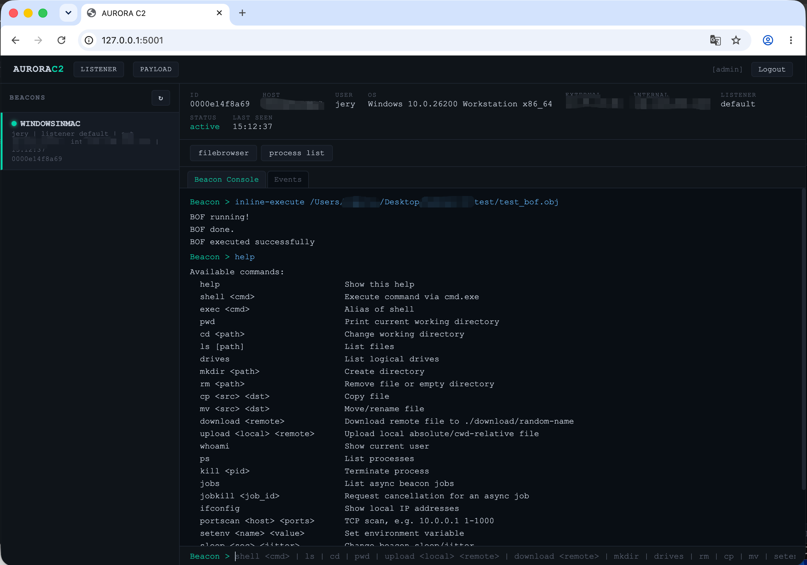
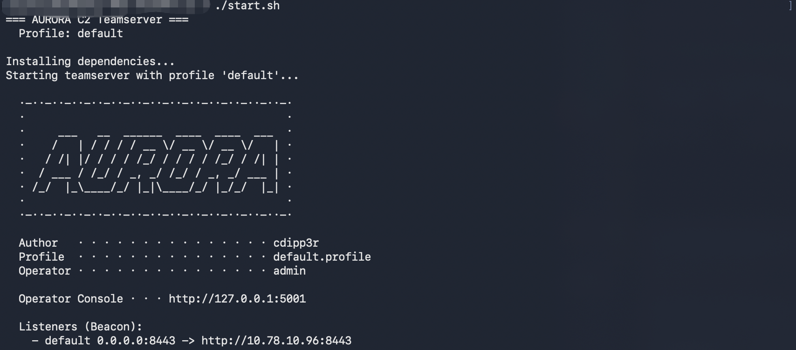

# AURORA C2

[中文版](README_CN.md)

AURORA C2 is a lightweight C2 framework for **authorized internal security exercises**, using a Team Server + Web UI + Windows Beacon (x64) architecture.

> For authorized security testing, red/blue team exercises, and educational research only. Unauthorized use is illegal.



## Components

| Component | Tech Stack | Description |
|---|---|---|
| Team Server | Python / FastAPI / SQLite | Beacon registration, task queue, result collection, event logging, etc. |
| Web UI | HTML / CSS / JS | Operator console, Beacon management, file/process views, etc. |
| Implant | C / Win32 / WinHTTP | Supports command execution, file transfer, BOF execution, in-memory .NET assembly loading, sRDI (`dllinject`), etc. |

The implant is not open source for now. If you encounter any bugs, please open an issue.

## Quick Start

### Linux / macOS

```bash
./start.sh
```



### Windows

```cmd
start.bat
```

## Usage

Open in your browser:

```text
http://127.0.0.1:5001
```

The Team Server runs two ports:
- **Operator port** (default `5001`, localhost only) — Web UI, REST API, WebSocket
- **Listener port** (default `8443`, from listener configuration) — Beacon callback only; can be changed in the Web UI `LISTENERS` panel (reload to apply, no restart needed)

Default login (recommended to change in the profile):

```text
admin / aurora_admin_2026
```

## Commands

```text
Available commands:
  help                         Show this help
  shell <cmd>                  Execute command via cmd.exe
  exec <cmd>                   Alias of shell
  pwd                          Print current working directory
  cd <path>                    Change working directory
  ls [path]                    List files
  drives                       List logical drives
  mkdir <path>                 Create directory
  rm <path>                    Remove file or empty directory
  cp <src> <dst>               Copy file
  mv <src> <dst>               Move/rename file
  download <remote>            Download remote file to ./download/random-name
  upload <local> <remote>      Upload local absolute/cwd-relative file
  whoami                       Show current user
  ps                           List processes
  kill <pid>                   Terminate process
  jobs                         List async beacon jobs
  jobkill <job_id>             Request cancellation for an async job
  ifconfig                     Show local IP addresses
  portscan <host> <ports>      TCP scan, e.g. 10.0.0.1 1-1000
  setenv <name> <value>        Set environment variable
  sleep <sec> <jitter>         Change beacon sleep/jitter
  inline-execute <path> [args] Execute a BOF (.o or .obj) inline on the beacon
  dllinject <pid> <dll_path> [export_fn] Inject DLL into remote process via sRDI
  execute-assembly <path> [args] Run .NET assembly in-memory via CLR hosting (sRDI)
  exit                         Terminate beacon
```

## Profile

See [profiles/README.md](profiles/README.md).

## Security Notes

- Change the default account, password, and RSA key pair before any exercise.
- HTTP is used by default. For production-like or cross-network use, place the Team Server behind a TLS reverse proxy if needed.
- Beacon sessions and task queues are mainly kept in Team Server runtime memory. Restarting the Team Server clears online state and task history.

## Legal Notice

For authorized security testing only. You must obtain explicit authorization before deployment or testing. The developers are not responsible for any misuse.
